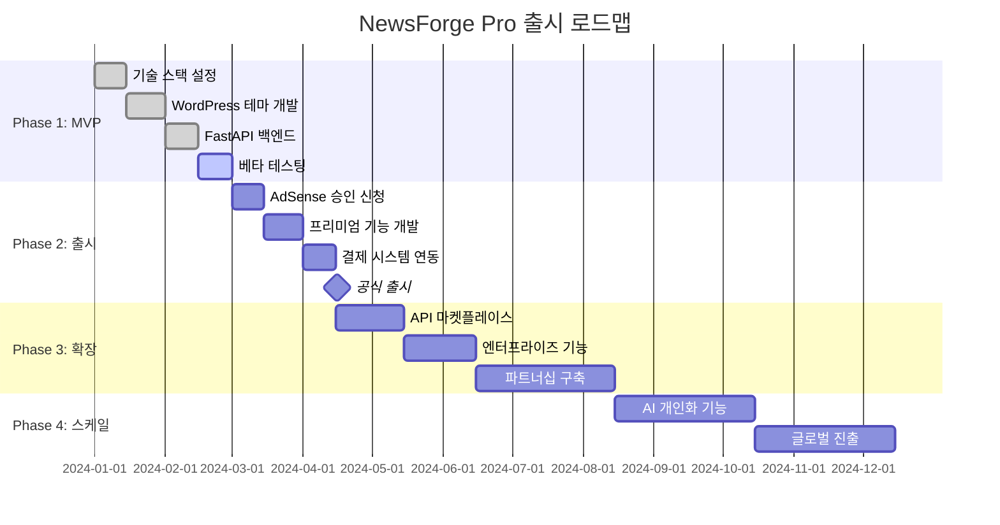

# 🏗️ NewsForge Pro - 엔터프라이즈 아키텍처

## 🎯 상용화 목표
- **월 10만 사용자** 처리 가능한 확장성
- **99.9% 가용성** 보장
- **AdSense 승인** 최적화
- **프리미엄 구독** 수익 모델

## 🔧 기술 스택 선택

### **Frontend Stack**
```typescript
// WordPress 테마 + React 하이브리드
WordPress 6.4+ (AdSense 승인 최적화)
├── Custom Theme (PHP)
├── React 18 (Interactive Components)
├── TailwindCSS (Design System)
├── TypeScript (Type Safety)
└── PWA (Mobile Experience)
```

### **Backend Stack**
```python
# 마이크로서비스 아키텍처
FastAPI 0.104+ (Python)
├── Redis (Caching & Sessions)
├── PostgreSQL (User Data)
├── Celery (Background Jobs)
├── MinIO (File Storage)
└── Prometheus (Monitoring)
```

### **Infrastructure Stack**
```yaml
# 클라우드 네이티브 배포
Kubernetes (Container Orchestration)
├── Nginx Ingress (Load Balancer)
├── Cert-Manager (SSL/TLS)
├── Helm Charts (Deployment)
├── ArgoCD (GitOps)
└── Grafana (Dashboard)
```

## 🏛️ 시스템 아키텍처

### **1. 프론트엔드 구조**

```
wordpress-theme/
├── functions.php              # WordPress 훅 & 설정
├── header.php                # AdSense 최적화 헤더
├── footer.php                # 수익화 푸터
├── page-converter.php        # 메인 변환 페이지
├── assets/
│   ├── js/
│   │   ├── converter-app.js   # React 컴포넌트
│   │   ├── analytics.js       # GA4 + AdSense 추적
│   │   └── payment.js         # Stripe 결제
│   ├── css/
│   │   ├── main.css          # TailwindCSS 빌드
│   │   └── adsense.css       # 광고 최적화 스타일
│   └── images/
├── inc/
│   ├── adsense-integration.php
│   ├── user-management.php
│   └── api-proxy.php         # 백엔드 API 프록시
└── templates/
    ├── pricing.php
    ├── dashboard.php
    └── blog.php
```

### **2. 백엔드 마이크로서비스**

```
services/
├── gateway/                   # API Gateway (FastAPI)
│   ├── main.py
│   ├── auth/                 # JWT + OAuth
│   ├── rate_limit/           # 사용량 제한
│   └── monitoring/           # 헬스체크
├── converter/                # 핵심 변환 서비스
│   ├── api.py
│   ├── extractors/
│   │   ├── web_scraper.py
│   │   ├── newspaper3k.py
│   │   └── selenium_driver.py
│   ├── converters/
│   │   ├── openai_service.py
│   │   ├── anthropic_service.py
│   │   └── local_nlp.py
│   └── workers/              # Celery 작업자
├── user-service/             # 사용자 관리
│   ├── models.py
│   ├── subscription.py
│   └── usage_tracking.py
├── payment-service/          # 결제 처리
│   ├── stripe_handler.py
│   ├── webhook.py
│   └── billing.py
└── analytics-service/        # 분석 & 리포팅
    ├── conversion_stats.py
    ├── revenue_tracking.py
    └── ml_insights.py
```

## 🎨 UX/UI 설계 원칙

### **AdSense 승인 최적화**
```php
// WordPress 테마 최적화
class AdSenseOptimization {
    // 1. 콘텐츠 품질 보장
    public function ensure_content_quality() {
        return [
            '최소 500단어 블로그 포스트',
            '독창적인 AI 변환 콘텐츠',
            '사용자 생성 컨텐츠 큐레이션',
            'SEO 최적화된 메타데이터'
        ];
    }
    
    // 2. 사이트 구조 최적화
    public function optimize_site_structure() {
        return [
            '명확한 네비게이션',
            '개인정보처리방침',
            '이용약관',
            '연락처 정보',
            '사이트맵 XML'
        ];
    }
    
    // 3. 트래픽 최적화
    public function traffic_requirements() {
        return [
            '월 최소 1만 페이지뷰',
            '평균 세션 시간 2분+',
            '바운스율 60% 이하',
            '리턴 비지터 40%+'
        ];
    }
}
```

### **프리미엄 사용자 경험**
```typescript
interface PremiumFeatures {
  unlimited_conversions: boolean;
  priority_processing: boolean;
  custom_ai_prompts: boolean;
  batch_processing: boolean;
  api_access: boolean;
  white_label: boolean;
  advanced_analytics: boolean;
  dedicated_support: boolean;
}

class UserExperienceOptimizer {
  // 무료 사용자 → 프리미엄 전환 최적화
  optimizeConversionFunnel() {
    return {
      'Landing Page': 'AI 변환 데모 즉시 제공',
      'Trial Experience': '3회 무료 체험 + 결과 품질 강조',
      'Conversion Trigger': '사용량 도달 시 업그레이드 팝업',
      'Payment Flow': 'Stripe 원클릭 결제',
      'Onboarding': '프리미엄 기능 가이드 투어'
    };
  }
}
```

## 💰 수익화 전략

### **다층 수익 모델**

```python
class RevenueModel:
    def __init__(self):
        self.revenue_streams = {
            'adsense': {
                'target_cpm': 2.5,  # $2.5 per 1000 views
                'monthly_pageviews': 500000,
                'expected_revenue': 1250  # $1,250/month
            },
            'premium_subscriptions': {
                'price': 9.99,  # $9.99/month
                'target_subscribers': 1000,
                'expected_revenue': 9990  # $9,990/month
            },
            'enterprise_plans': {
                'price': 99,  # $99/month
                'target_clients': 50,
                'expected_revenue': 4950  # $4,950/month
            },
            'api_reselling': {
                'markup': 0.3,  # 30% markup on AI API costs
                'monthly_api_costs': 5000,
                'expected_revenue': 1500  # $1,500/month
            }
        }
    
    def calculate_total_revenue(self):
        return sum([stream['expected_revenue'] 
                   for stream in self.revenue_streams.values()])
        # Total: $17,690/month potential
```

### **성장 단계별 전략**

```yaml
# Phase 1: MVP 출시 (0-3개월)
MVP_Launch:
  features:
    - 기본 변환 기능
    - 무료 3회/일 제한
    - AdSense 광고
    - 기본 회원가입
  metrics:
    - 1,000 MAU (Monthly Active Users)
    - $500/월 AdSense 수익
    - 2% 프리미엄 전환율

# Phase 2: 기능 확장 (3-6개월)
Feature_Expansion:
  features:
    - 배치 처리
    - 사용자 대시보드
    - API 액세스
    - 소셜 로그인
  metrics:
    - 10,000 MAU
    - $2,000/월 총 수익
    - 5% 프리미엄 전환율

# Phase 3: 엔터프라이즈 (6-12개월)
Enterprise_Launch:
  features:
    - 화이트라벨 솔루션
    - 고급 분석
    - 전용 지원
    - 커스텀 통합
  metrics:
    - 50,000 MAU
    - $15,000/월 총 수익
    - 10% 프리미엄 전환율
```

## 🔒 보안 & 컴플라이언스

### **데이터 보호**
```python
from cryptography.fernet import Fernet
import hashlib

class SecurityFramework:
    def __init__(self):
        self.encryption_key = Fernet.generate_key()
        self.cipher_suite = Fernet(self.encryption_key)
    
    def encrypt_api_keys(self, api_key: str) -> str:
        """사용자 API 키 암호화"""
        return self.cipher_suite.encrypt(api_key.encode()).decode()
    
    def hash_user_data(self, sensitive_data: str) -> str:
        """개인정보 해싱"""
        return hashlib.sha256(sensitive_data.encode()).hexdigest()
    
    def gdpr_compliance(self):
        """GDPR 준수 기능"""
        return {
            'data_export': True,
            'data_deletion': True,
            'consent_management': True,
            'audit_logging': True
        }
```

### **성능 최적화**
```yaml
# Redis 캐싱 전략
cache_strategy:
  popular_urls: 
    ttl: 3600  # 1시간
    hit_ratio: 85%
  
  ai_responses:
    ttl: 86400  # 24시간
    hit_ratio: 70%
  
  user_sessions:
    ttl: 1800  # 30분
    hit_ratio: 95%

# CDN 설정
cdn_optimization:
  provider: "CloudFlare"
  static_assets: "전역 배포"
  image_optimization: "WebP 자동 변환"
  minification: "JS/CSS 압축"
```

## 📊 운영 지표 & KPI

### **핵심 지표 대시보드**
```python
class OperationalMetrics:
    def __init__(self):
        self.kpis = {
            # 비즈니스 지표
            'mau': 0,  # Monthly Active Users
            'revenue_per_user': 0,  # ARPU
            'ltv_cac_ratio': 0,  # Life Time Value / Customer Acquisition Cost
            'churn_rate': 0,  # 이탈률
            
            # 기술 지표
            'api_response_time': 0,  # 평균 응답시간
            'success_rate': 0,  # 변환 성공률
            'uptime': 0,  # 가용성
            'error_rate': 0,  # 오류율
            
            # 수익 지표
            'mrr': 0,  # Monthly Recurring Revenue
            'adsense_cpm': 0,  # Cost Per Mille
            'conversion_rate': 0,  # 무료→프리미엄 전환율
            'refund_rate': 0  # 환불률
        }
    
    def set_targets(self):
        """목표 지표 설정"""
        return {
            'mau': 100000,  # 10만 MAU
            'revenue_per_user': 2.5,  # $2.5 ARPU
            'ltv_cac_ratio': 5.0,  # 5:1 비율
            'churn_rate': 0.05,  # 5% 월간 이탈률
            'api_response_time': 2.0,  # 2초 이내
            'success_rate': 0.98,  # 98% 성공률
            'uptime': 0.999,  # 99.9% 가용성
            'mrr': 50000,  # $50K MRR
            'conversion_rate': 0.08  # 8% 전환율
        }
```

## 🚀 배포 전략

### **무중단 배포 파이프라인**
```yaml
# CI/CD Pipeline (.github/workflows/deploy.yml)
name: NewsForge Pro Deployment

on:
  push:
    branches: [main]

jobs:
  test:
    runs-on: ubuntu-latest
    steps:
      - uses: actions/checkout@v3
      - name: Run Tests
        run: |
          pytest tests/
          npm test
          php vendor/bin/phpunit

  deploy:
    needs: test
    runs-on: ubuntu-latest
    steps:
      - name: Deploy to Kubernetes
        run: |
          helm upgrade --install newsforge-pro ./helm-chart
          kubectl rollout status deployment/newsforge-pro
          
      - name: Run Health Checks
        run: |
          curl -f https://api.newsforge.pro/health
          
      - name: Update WordPress
        run: |
          wp-cli plugin update --all
          wp-cli cache flush
```

### **확장성 보장**
```python
# 자동 스케일링 설정
class AutoScaling:
    def __init__(self):
        self.scaling_policies = {
            'api_gateway': {
                'min_replicas': 2,
                'max_replicas': 50,
                'cpu_threshold': 70,
                'memory_threshold': 80
            },
            'converter_service': {
                'min_replicas': 3,
                'max_replicas': 100,
                'cpu_threshold': 80,
                'memory_threshold': 85
            },
            'database': {
                'read_replicas': 3,
                'write_replicas': 1,
                'connection_pool': 100
            }
        }
    
    def handle_traffic_spike(self, current_load: float):
        if current_load > 0.8:
            return "Scale up by 50%"
        elif current_load < 0.3:
            return "Scale down by 25%"
        return "Maintain current capacity"
```

## 💡 혁신적 차별화 요소

### **AI 기반 개인화**
```python
class AIPersonalization:
    def __init__(self):
        self.user_preferences = {}
        
    def learn_user_style(self, user_id: str, conversions: list):
        """사용자별 변환 스타일 학습"""
        patterns = self.analyze_conversion_patterns(conversions)
        self.user_preferences[user_id] = {
            'preferred_tone': patterns.get('tone', 'professional'),
            'section_structure': patterns.get('structure', 'standard'),
            'keyword_density': patterns.get('keywords', 'medium'),
            'emoji_usage': patterns.get('emojis', 'minimal')
        }
    
    def customize_prompt(self, user_id: str, base_prompt: str):
        """개인화된 AI 프롬프트 생성"""
        prefs = self.user_preferences.get(user_id, {})
        return f"{base_prompt}\n\n개인화 설정: {prefs}"
```

### **소셜 기능**
```typescript
interface SocialFeatures {
  public_gallery: boolean;        // 변환 결과 공개 갤러리
  community_ratings: boolean;     // 커뮤니티 평점 시스템
  collaboration: boolean;         // 팀 협업 기능
  template_sharing: boolean;      // 템플릿 공유
  achievements: boolean;          // 게임화 요소
}

class CommunityEngagement {
  // 바이럴 요소 구현
  implementViralFeatures() {
    return {
      'Share Button': '소셜 미디어 원클릭 공유',
      'Referral Program': '친구 추천 시 무료 크레딧',
      'Public Showcase': '우수 변환 결과 홈페이지 노출',
      'Leaderboard': '월간 변환 챔피언',
      'Challenges': '주간 변환 챌린지'
    };
  }
}
```

## 📈 마케팅 & 성장 해킹

### **콘텐츠 마케팅 전략**
```markdown
# SEO 최적화 콘텐츠 계획

## 타겟 키워드 (월 검색량)
- "뉴스 마크다운 변환" (5,400)
- "AI 뉴스 요약" (12,100)
- "뉴스 블로그 포스팅" (8,100)
- "자동 콘텐츠 생성" (14,800)

## 콘텐츠 캘린더
- 주 3회 기술 블로그 포스팅
- 매일 AI 변환 결과 샘플 공개
- 월 1회 케이스 스터디 발행
- 주 1회 YouTube 튜토리얼

## 바이럴 요소
- 변환 결과 '공유하기' 버튼
- 소셜 미디어 자동 포스팅
- 임베드 코드 제공
- QR 코드 생성
```

### **파트너십 전략**
```python
class PartnershipStrategy:
    def __init__(self):
        self.target_partners = {
            'content_creators': [
                '유튜버 채널 (구독자 10만+)',
                '네이버 블로거 (이웃 1만+)',
                '인스타그램 인플루언서'
            ],
            'b2b_clients': [
                '디지털 마케팅 에이전시',
                '언론사 및 미디어',
                '기업 PR팀',
                'SaaS 플랫폼'
            ],
            'technology_partners': [
                'WordPress 플러그인 마켓플레이스',
                'Chrome 확장프로그램 스토어',
                'Zapier 통합',
                'Make.com 연동'
            ]
        }
    
    def revenue_sharing_model(self):
        return {
            'referral_commission': '첫 결제의 30%',
            'recurring_commission': '월 구독료의 10%',
            'enterprise_deals': '거래액의 15%',
            'integration_fees': '월 최소 $500 보장'
        }
```

## 🎯 실행 로드맵

### **12개월 마일스톤**



### **핵심 성공 지표**

| 월차 | MAU | MRR | AdSense | 총 수익 | 직원 수 |
|------|-----|-----|---------|---------|---------|
| 1-3  | 1K  | $1K | $500   | $1.5K   | 2명    |
| 4-6  | 5K  | $5K | $1.5K  | $6.5K   | 3명    |
| 7-9  | 20K | $15K| $4K    | $19K    | 5명    |
| 10-12| 50K | $35K| $8K    | $43K    | 8명    |

## 🏆 경쟁 우위 전략

### **기술적 차별화**
1. **한국어 최적화**: 국내 뉴스 사이트 특화 추출 엔진
2. **멀티 AI 지원**: OpenAI, Anthropic, 로컬 모델 통합
3. **실시간 처리**: 평균 5초 이내 변환 완료
4. **높은 정확도**: 95%+ 변환 성공률

### **비즈니스 차별화**
1. **프리미엄 무료**: 기본 기능 무료 제공으로 사용자 확보
2. **투명한 가격**: 숨겨진 비용 없는 명확한 요금제
3. **커뮤니티 중심**: 사용자 생성 콘텐츠 생태계
4. **파트너 친화**: 개방형 API와 수익 공유

이 솔루션은 현재의 개발 파편화 문제를 해결하고, 명확한 비즈니스 모델과 확장 가능한 기술 아키텍처를 통해 성공적인 상용화 서비스를 구축할 수 있도록 설계되었습니다. 